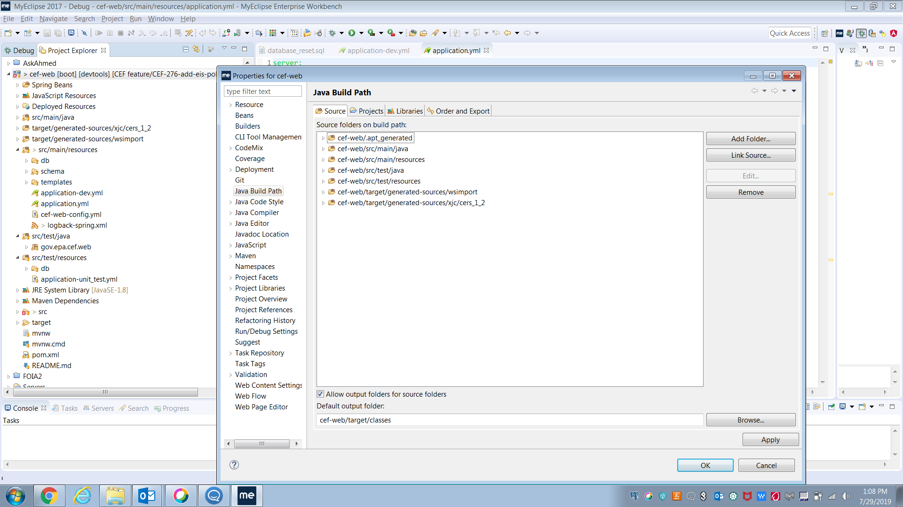

# Common Air Emissions Reporting System (CAERS)

## Getting Started
The CAERS project includes a PostreSQL database, Java Web Services that execute on the server, and uses Angular 2 as its front-end framework.  This document identifies how to set up your environment in order to  run CAERS locally, whether it's on a local web server or as a Spring Boot app.  We start with the installation of the software that is expected in your local environment.  After that is the database setup instruction for creating the schema, running the migrations, and loading sample data to start with.  Then you can build and run all on your local machine!  Of course, you could use the .war file that's built and install it on a web server running on a different server too.

At the bottom of the document are some helpful tips on how to create new Angular components, services, etc.  We also included some guidance on running the unit tests in a couple of different ways.

## Install Required Software
- Install the following software on your local computer
    - PostgreSQL and pgAdmin
        - We're currently using v10 
        - [PostgreSQL Download](https://www.enterprisedb.com/downloads/postgres-postgresql-downloads)
    - Java 8 (Oracle or open source version)
        - Get the AdoptOpenJDK java as a zip file, not installable executable.
        - Unzip to your computer.
        - Set/create a JAVA_HOME environment variable (user environment variables, not "system" environment variables)
        - [Java Download](https://adoptopenjdk.net/archive.html?variant=openjdk8&jvmVariant=hotspot) - get the latest version of Java 8 from the AdoptOpenJDK binaries
    - Node.js  
        - Get Node.js as a binary and then unzip onto your computer somewhere useful (e.g. C:\node-v12.14.0-win-x64).
        - Add the home directory to your PATH variable in your local environment variables
            
        - [Node JS Download](https://nodejs.org/en/download/)
    - Angular CLI 
        - [Angular Download](https://cli.angular.io/)
    - Apache Maven 
        - Used for code compilation (you can also use Maven capabilities built into your IDE, such as Eclipse)
        - Add the Maven \bin directory to your PATH environment variable
        - [Apache Maven Download](https://maven.apache.org/download.cgi)
    - Git client 
        - You can choose your favorite tool for interacting with Git (e.g. Source Tree, Git command line)
        - If using Git from the command line, it's helpful to add the Git \cmd directory to the PATH environment variable
        - [Source Tree Download](https://www.sourcetreeapp.com/)
        - [Git](https://git-scm.com/downloads)
    - Tomcat 8 
        - This is optional.  You can run from Eclipse or the command line as a SpringBoot app.
        - [Tomcat Download](https://tomcat.apache.org/download-80.cgi)
- Download the Code base on your local machine
    - Clone using your chosen Git client (e.g. SourceTree, Git command line)
        ```bash
        git clone <URL>
        ```

## Eclipse Setup
1. Import the code into Eclipse as a Maven-enabled project
    - File→Import→Existing Maven Projects
2. Optionally install the following Eclipse plugins from Eclipse Marketplace:
    - Codemix (specifically the Typescript components) - for superior compilation, errors, warnings, etc. for Angular and Typescript.
    - EclEMMA - for Code Coverage

## IntelliJ Setup
If you are experiencing issues with running CAERS from the oar-caer repository, proceed with all steps in order. If you are setting up your project for the first time and have a copy of the development branch on your computer, skip step 2:

1. Backup run configurations (if applicable)
   1. If you have the run configurations already:
      1. Copy your current run configurations and save them where you can find them later. You should be able to find them in either the .idea or .run folder.
   2. If you do not have the run configurations:
      1. A team member may be able to send you copies of the .xml files. Otherwise, you will need to create them manually.
2. Before reimporting the project:
   1. Delete the .idea folder in your currently imported oar-caer project
   2. Close out of Intellij
3. Reimport and configure the project:
   1. From the command line, go to the desired project folder and run `mvn clean install`. This ensures that the target folder exists before importing.
   2. Reopen IntelliJ, and select File -> New -> Project from Existing Sources
      1. Select Maven and import the project at the cef-web directory level
   3. Right-click on the cef-web folder, then select Open Module Settings -> Project
      1. Change the SDK to java 8, or the current version used in CAERS
      2. Change the language level to 8, or the current version used in CAERS
   4. In the cef-web directory, add a subfolder called .run if it does not already exist
   5. Paste your run configuration files within the .run folder


## PostgreSQL Setup
- This will likely require admin rights to install this on your local environment.
- If you get the PostgreSQL intallation error `Unable to write inside TEMP environment variable path`
    1. Create a new directory on your machine (e.g. C:\NOTTEMP)
    2. Using admin credentials, change environment variables for TEMP and TMP to write to C:\NOTTEMP instead of C:\TEMP or %windows%\TEMP or whatever else is in there 
        - Copy the existing paths into notepad so you can copy them back later.
        - Change both the SYSTEM and the current user (the admin’s) environment variables.
        - Also, use the “SET” command on the windows command prompt to change the non-admin credentials 
            ```bash
            SET TEMP=C:\NOTTEMP
            ```
    3. Run the PostgreSQL installer by right-clicking on the .exe file and then “Run as Administrator” – it should be able to install normally.
    4. Set the TEMP and TMP environment variables back to their original state
- Set up a local "CEF" schema on your local PostgreSQL database with password = "password". This is the default setting for the local development environment connection strings
    - driver-class-name: "org.postgresql.Driver"
    - url: "jdbc:postgresql://localhost:5432/CEF"
    - username: cef
    - password: password
- Set up a connection to the CDX development database.  
    - **Only attempt connecting to the dev database if you're able to connect to the CDX VPN (external contributors will not have this ability and should develop against their new local database)**
    - Make sure your local pgAdmin can connect to the CDX development database. Note: you will need to be on the CDX VPN to be able to access this database (Request a [CDX developer account](https://alm.cgifederal.com/collaborate/display/CDXO/Request+a+CDX+developer+account)).
    - host: cdx-pgs-general-shared-dev-01.cloud.epacdx
    - port: 5432
    - database: CEF
    - username: USERNAME_REMOVED
    - password: PASSWORD_REMOVED

## Building CAERS
- ### Maven build
    - Create application-dev.yml and application-unit_test.yml files
        - Copy the application-dev.example.yml file into the /src/main/resources/ directory, name it application-dev.yml, and update configuration settings based on your local environment
        - Copy the application-unit_test.example.yml file into the /src/test/resources/ directory, name it application-unit_test.yml, and update configuration settings based on your local environment
        - At a minimum, set the NAAS Username and NAAS Password that are removed from the example properties files
    - Run Maven Install to  build the application
        ```bash
        mvn clean install
        ```
    - Maven install should generate source code for the application including class files generated from WSDLs and Mapper interfaces that will allow some of the CAERS source code to compile correctly. You may need to make sure these generated classes are included in your Eclipse "source code" setup (see screenshot below).  *NOTE- instead of .apt_generated, the mapstruct classes may be generated by eclipse into /cef-web/target/generated-sources/annotations
        
    - When you start up the application, flywaydb should automatically install the DML for the test database on your local PostgreSQL.
    - Execute the /src/test/resources/db/test_data_dml.sql script to insert test data into your local database.
    - Database can be reverted to an empty state by running  /src/test/resources/db/database_reset.sql, and then restarting the application again, which will re-run all the database migrations.
    - If using your local Tomcat 8 server, navigate to http://locahost:8080/cef-web to test if the application is up and running. If you are manually running the code in a different websever the url will be: http://hostname:port/cef-web
- ### Angular only build
    - From within the `src/main/webapp` directory, run `ng build` to build the Angular part of the project. The build artifacts will be stored in the `target/www/` directory. 
    - Use the `--prod` flag for a production build.  This is automatically done by Maven frontend plugin in the pom.xml.

## Running CAERS
- The Angular part of this project was generated with [Angular CLI](https://github.com/angular/angular-cli) version 7.3.8. The Angular code lives in `src/main/webapp`
- Run the application as a Spring Boot app
    ```bash
    mvn spring-boot:run
    ```
- Navigate to `http://localhost:8080/cef-web`
- Open a command line and navigate to your project and to `src/main/webapp` and run `ng build --watch` to continuously build the Angular TypeScript code while developing and reloading it.

## Run locally on Tomcat
- Edit the Tomcat eclipse server and modify the launch configuration and add `-Dspring.profiles.active=dev` this helps the server set the right spring profile when starting the app.
- Make sure you have the Dynamic Web Module facet enabled so it keeps synching your web resources to the server.

## Angular Code scaffolding
- Use ng commands to generate new components
    ```bash
    ng generate component component-name
    ```
- You can also use ng command to generate directives, pipes, services, classes, guards, interfaces, enum, or modules
    ```bash
    ng generate directive|pipe|service|class|guard|interface|enum|module
    ```


## Running unit tests
- ### Java
    ```bash
    mvn test
    mvn -P allTests test
    ```
    - Unit tests can be categorized using JUnit `@Category` annotation. 
    - The categories and their hierarchy are in `TestCategories.java`. The categories are used in pom.xml in the Surefire plugin to segregate tests in maven profiles.
    - Units test annotated with `@Category(TestCategories.FastTest.class)` are run by default; `mvn test`.
    - All unit tests can be run by adding a profile, `-P allTests`.

- ### Embedded Database Tests
    - Annotating the Test Class with the following will start up a PostgreSQL embedded database and replace the dataSource created by Spring Boot with a datasource that points to the embedded database. All Spring Boot initialization, including Flyway, will use the embedded database. 
        ```java
        @Category(TestCategories.EmbeddedDatabaseTest.class)
        @RunWith(SpringRunner.class)
        @SpringBootTest
        @AutoConfigureEmbeddedDatabase
        ```
    - #### Test Preparation
        - Concepts can be found [here](https://reflectoring.io/spring-boot-data-jpa-test/)
        - The embedded database is shared in the scope of the `@SpringBootTest`. This can cause test method conflicts or dependencies if the database is not "cleansed" before each test method.
        - The use of `@SqlGroup(value = {@Sql("classpath:db/test/controlRepositoryITCase-1.sql")})` to prepare the database before each @Test method is straight forward. 
        - The annotation can be at the Class or Method level. The SQL is run before each @Test method.
- ### Angular
    - Run `ng test` to execute the unit tests via [Karma](https://karma-runner.github.io).
    - Run `ng e2e` to execute the end-to-end tests via [Protractor](http://www.protractortest.org/).
- ### Further help
    - To get more help on the Angular CLI use `ng help`
    - Or, go check out the [Angular CLI README](https://github.com/angular/angular-cli/blob/master/README.md).


## License
© Copyright 2019 EPA CAERS Project Team

This file is part of the Common Air Emissions Reporting System (CAERS).

CAERS is free software: you can redistribute it and/or modify it under the terms of the GNU General Public License as published by the Free Software Foundation, either version 3 of the License, or (at your option) any later version.

CAERS is distributed in the hope that it will be useful, but WITHOUT ANY WARRANTY; without even the implied warranty of MERCHANTABILITY or FITNESS FOR A PARTICULAR PURPOSE.  See the GNU General Public License for more details.

You should have received a copy of the GNU General Public License along with CAERS.  If not, see [GNU Licenses](https://www.gnu.org/licenses/).
